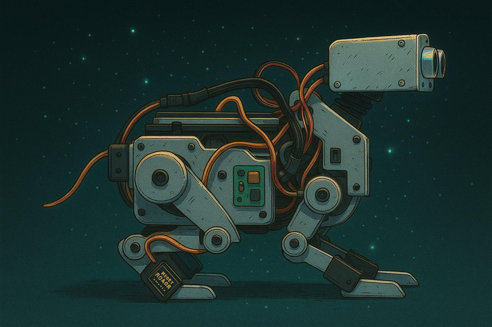

# 🐾 **NovaK9 – Your Smart AI Home Companion**

> *An all-in-one intelligent robotic companion for elderly care, child monitoring, and home security – inspired by the loyalty of a canine.*

This repository contains the conceptual designs for the **ground-level robotic project NovaK9** with guard and notification features.

 <!-- Replace with your hero image/GIF -->

---

## ✨ **Overview**

NovaK9 is a compact, mobile, and interactive **AI-powered robotic companion** designed to bring together:

* 🧓 **Elderly Assistance** – Obstacle detection, walking support, and companionship.
* 👶 **Child Monitoring** – Camera-based monitoring with alerts for parents on-the-go.
* 🏠 **Home Security** – AI-driven face recognition to detect strangers indoors.

---

## 🦴 **Key Features**

* 🛑 **Obstacle Detection & Walking Aid**
  Utilizes an **ultrasonic sensor** for safe navigation and support for the elderly.

* 📷 **Camera Monitoring & Alerts**
  Stay connected with your children using **real-time monitoring and notifications**.

* 🤖 **AI Face Recognition**
  Distinguishes **known vs. unknown individuals** for enhanced home security.

* 🎧 **Sound Direction Sensing**
  Reacts to noises in the home using its directional sound sensor.

* 🎮 **Remote Control**
  Operate NovaK9 remotely with a **modified FLYSKY RC controller** for extended range.

* 🧠 **Dual Microprocessor Architecture**

  * **Arduino Uno** for sensor data processing.
  * **Raspberry Pi 4** for high-level execution and AI tasks.

* 🔋 **2000mAh Rechargeable Battery**
  Long-lasting and easy to charge.

* 🌈 **LED Strip & Wagging Tail**
  Adds personality and interaction to the experience.

* 🏗 **Lightweight Aluminum Chassis**
  Compact, durable, and easy to move around the home.

---

## 🐕 **Unique Selling Proposition (USP)**

NovaK9 is **not just another robot** – it’s:

* A **3-in-1 solution** combining elderly care, childcare monitoring, and home security.
* **Emotionally relatable**, designed after K9 loyalty, making it a **pet-like companion without the maintenance**.
* **Active**, not passive – it moves, avoids obstacles, and assists rather than just observes.
* Perfect for people **allergic to dogs** or those who want a companion without the hassle of a real pet.

---

## 🔮 **Future Enhancements**

> *Exciting features under research and development:*

* **AI-Powered People Identification** – Real-time alerts for visitors or strangers.
* **Reinforcement Learning** – Learns and remembers faces over time.

---

## 📦 **Technical Specifications**

* **Head Movement**: 3 Degrees of Freedom (DOF)
* **Battery**: 2000 mAh Li-ion, rechargeable
* **Microprocessors**: Arduino Uno & Raspberry Pi 4
* **Control**: Modified FLYSKY RC for long-range remote operation
* **Chassis**: Lightweight Aluminum

---

## 🚀 **Getting Started**

### 1. **Clone this Repository**

```bash
git clone https://github.com/your-username/NovaK9.git
cd NovaK9
```

### 2. **Install Dependencies**

```bash
npm install
# or
yarn install
```

### 3. **Run the Project**

```bash
npm start
```

---

## 🎥 **Demo**

<h1></h1>

---

## 🧠 **How NovaK9 Works**

1. **Sensors detect obstacles and sound direction**
2. **AI module processes faces & environment**
3. **Remote commands and autonomous decisions merge seamlessly**
4. **Interactive LEDs and tail wagging enhance companionship**

---

## 🤝 **Contributing**

Contributions are welcome! Please **fork the repository**, create a feature branch, and submit a pull request.

---

## 📜 **License**

This project is licensed under the **MIT License** – see the [LICENSE](LICENSE) file for details.

---

## ❤️ **Acknowledgements**

* Inspired by the **loyalty of K9 companions**
* Built using **Arduino & Raspberry Pi**
* Special thanks to the community for feedback & testing